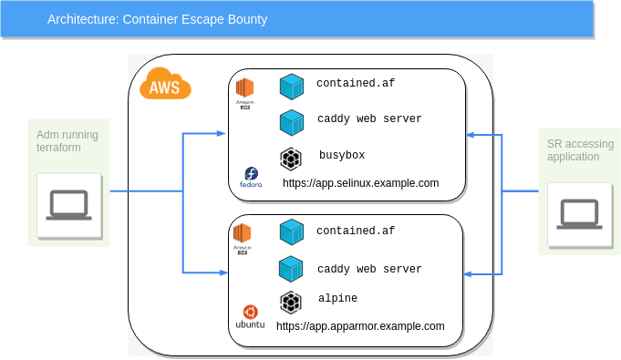

# Architecture

## Application setup

Here is the diagram which explains the general workflow of the user with the application setup. On the left you can see that the Adm has created the whole setup using terraform scripts. And once the setup is created the SR can access it via webbrowser on the generated URLs provided by the Adm.



The terminal on the browser is backed by a persistant websocket connection.

## Terraform setup

The terraform code in [terraform directory](../terraform) at the root of this project sets up the application on AWS in two VMs.

There are two different VMs currently because one support Apparmor and other supports SELinux. Having both in the same machine is problematic and introduces it's own set of issues so to separate concerns we have put it in two different VMs.

### Code setup

The code tree looks like following:

```bash
├── flagfiles.tf
├── locals.tf
├── machine.tf
├── output.tf
├── password.tf
├── provider.tf
├── provisioning
│   ├── common.bash
│   ├── fedora.bash
│   └── ubuntu.bash
├── provision.tf
├── terraform.tfvars.tmpl
├── variables.tf
└── vpc.tf
```

* `provider.tf` configures the provider which currently is only AWS.

* `vpc.tf` sets up VPC on AWS for the machines to run in.

* `machine.tf` sets up the VMs on AWS.

* `provision.tf` runs the scripts in `provisioning` directory, after the machines boot up on AWS.

* `provisioning` directory has scripts that run on the respective machines to setup docker, the contained.af application and caddy web server.

* `flagfiles.tf` sets up the random flag that will be available on the host machines to be captured by SR from the container they have access to.

* `password.tf` generates the password which will be provided by Adm to the SR to be used to login into the application.

* `locals.tf` has all the local variables to be accessed in code.

* `output.tf` will output various variables for the Adm to see viz: URLs to machines which will be provided to SR.

* `variables.tf` declares all the variables that Adm can declare in their terrafor variables file (file with extension `*tfvars`).

* `terraform.tfvars.tmpl` is a sample terraform variables file which the Adm will refer to as starting point of their application setup.
